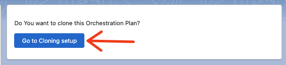
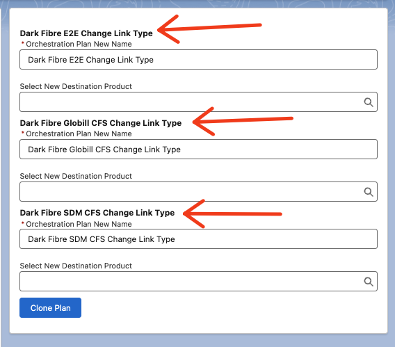

# Clone Orchestration Plan

## Overview

This project aims to facilitate the cloning of Orchestration Plans in Salesforce. The provided Apex class allows for the creation of a new Orchestration Plan with a specified name and the cloning of associated child records.

## Table of Contents

- [Features](#features)
- [Installation](#installation)
- [Usage](#usage)

## Features

- Clone an existing Orchestration Plan.
- Copy child records associated with the Orchestration Plan, including:
  - Orchestration Scenarios
  - Orchestration Plan Definitions
  - Orchestration Item Definitions
  - Orchestration Item Dependency

## Installation

1. Clone the repository.
2. Deploy the provided Apex class (`CloneOrchestrationScenario.cls`) to your Salesforce environment.
3. Deploy the Lightning Web Component (LWC) by following these steps:
4. Ensure necessary permissions for the executing user to perform cloning and insertion operations.
5. Add the LWC component to the Orchestration Scenario flexipage:
   - Navigate to Setup in your Salesforce org.
   - Go to the Object Manager and find `Orchestration Scenario`.
   - Open the `Lightning Record Pages` section.
   - Edit the flexipage that your Orchestration Scenario uses.
   - Drag and drop the `cloneOrchestrationPlan` component onto the flexipage in the desired location.
   - Save the flexipage.

Now, when viewing an Orchestration Scenario, the `cloneOrchestrationPlan` component should be visible and can be used for easy interaction with the cloned Orchestration Plans.

## Usage

1. Go to Orchestraion Scenario that is your start point (that means it has the last Orchestration Item)
2. Press the button 'Go to Cloninbg Setup' on added LWC component

3. Script fill find all related Orchestration Scenarior.
4. Populate the new name and new destination product for each found Orchestration Scenario

5. Press 'Clone Plan'

